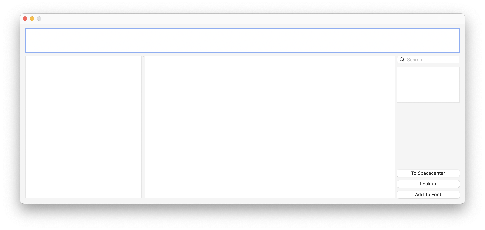

# RoboHackathon ezui

[Ezui](https://typesupply.github.io/ezui/index.html) is a toolkit that makes it easy (EZ) to build user interfaces (UI).

Examples and exercises as shown during the [RoboHackathon](https://robofont.com/events/robohackathonMarch2023/).

---

---

---

---

---

---

